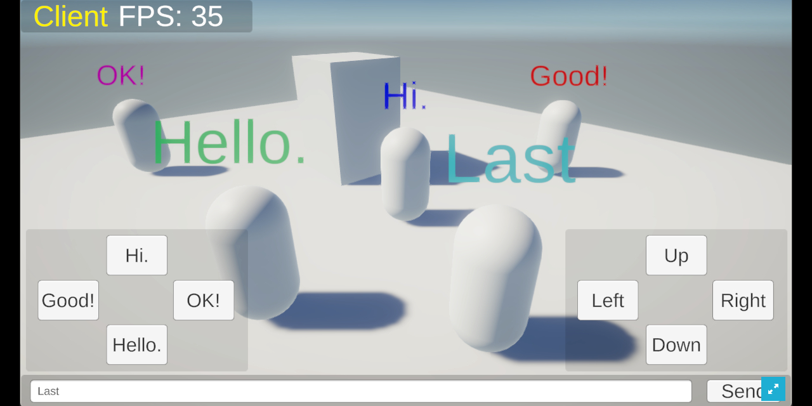
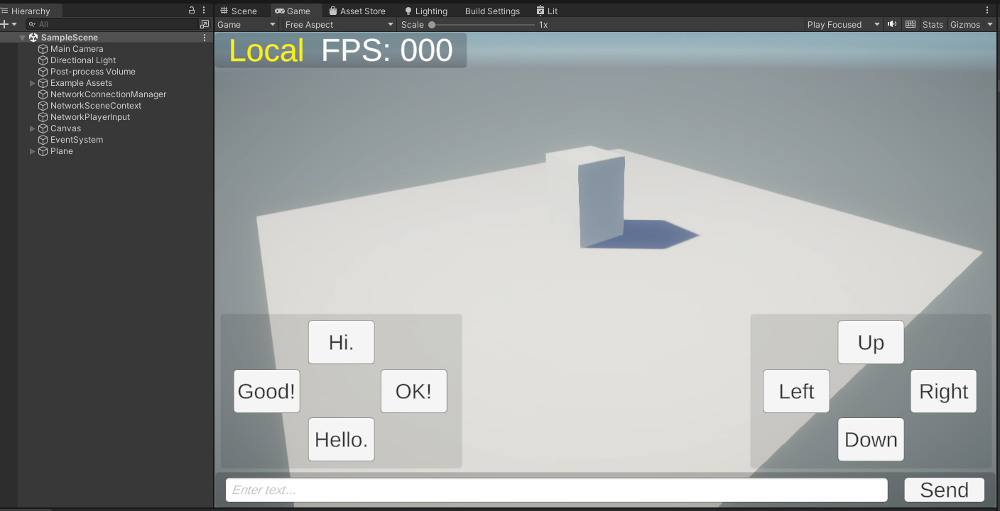

# What is this?

シンプルなオンラインゲーム開発基盤です  
プレイヤーが移動し、テキストを送信すると、プレイヤーの頭上に表示されます（超シンプル）  
途中でホストがゲームを終了しても、残りのクライアントがホストに切り替わりセッションが継続します  

いろいろなリアルタイム通信ゲームに派生できると思います  
MIT ライセンス公開ですので、ぜひみなさんのプロジェクトのオンラインゲーム基盤としてご利用ください  
利用報告は不要ですがハッシュタグ #SimpleChatPhoton でツィートいただけると見つけて拡散協力します  

内容物のほとんどは [Photon Fusion セミナー 第 3 回](https://photonjp.connpass.com/event/273406/)
で解説しているスクリプトコンポーネントです  
今回さらに簡略化しています  
次の How to Play で示す手順を踏めば、誰でもお手元でオンライン化するシーンを確認できるでしょう  

実際に動作するデモはこちら(複数タブで通信を試せます) → https://d1nl077dbzu98o.cloudfront.net/SimpleChatPhoton/index.html  

WebGLビルドしたゲームの公開方法が気になる方は発表資料の末尾に解説加えました → https://www.photonengine.jp/pdf/simplestar.pdf

# How to Play

1. 本リポジトリをクローンしたら、Unity Hub 経由でクローンしたフォルダからプロジェクトを開きます  
1. その後 [Photon Fusion SDK](https://doc.photonengine.com/fusion/current/getting-started/sdk-download) のページから .unitypackage をダウンロードし、プロジェクトにインポートします  
1. Photon Fusion のアプリを [Dashboard](https://dashboard.photonengine.com/) ページから作成し、App ID を PhotonAppSettings ファイルに書き込みます

コンパイルエラーが解消すると思うので、Assets/URPSample/Scenes/SampleScene.unity シーンを開いて実行すると動作が確認できます  

